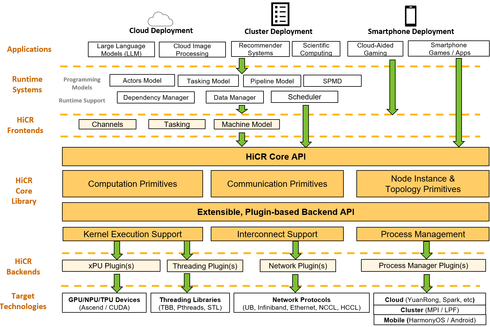
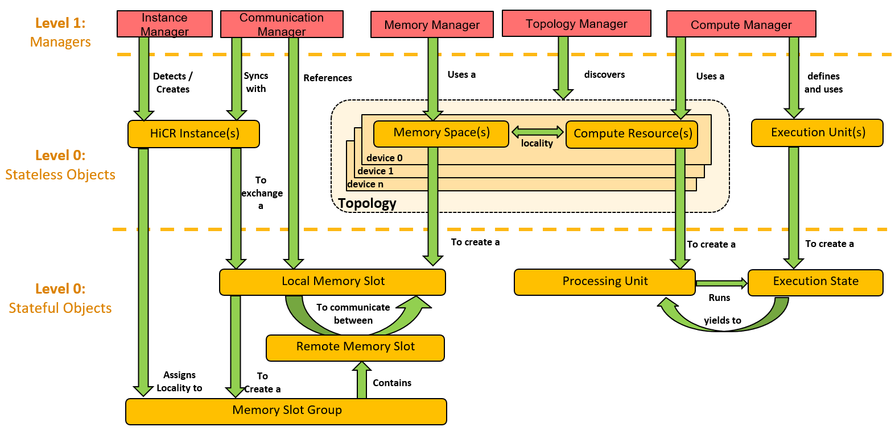

.. _hicr:

***************
Overview
***************

HiCR is a support library for the development of future-proof, high-performance runtime systems and applications. Its goal is to serve as the foundation layer for kernel execution, thread and task scheduling, resource management, and data motion capabilities over heterogeneous, distributed, mobile, and cloud-based systems. 

HiCR provides an architecture-agnostic API (see: :ref:`coreAPI`) which enables low-level access to the system's resources while abstracting out implementation details. :numref:`HiCRStack` shows how HiCR serves as a layer between an application or runtime systems and the underlying technologies.

.. _HiCRStack:

   
   HiCR Software Stack

.. _frontends:

Frontends
###########

Frontends are highly-optimized HiCR-based libraries which provide out-of-the-box high level features for communication, deployment and computation. The goal of frontends is to facilitate the adoption of HiCR without requiring users to use its low-level API. Since these libraries are implemented exclusively on top of the HiCR Core API, they remain architecture-agnositc and can their operations can be supported by different backends. A list of built-in frontends can be found in :ref:`builtInFrontends`. 

.. _coreAPI:

Core API
##########

HiCR's Core API exposes a machine model that seeks to represent all current and future computational devices under the von Neumann architecture. The model consists of two layers of abstraction (see :numref:`HiCRCoreAPI`):

.. _HiCRCoreAPI:

   
   HiCR Core API Model

HiCR only provides an abstract definition for the classes defined in its Core API. These classes are not meant to be used by programmers directly. Instead, the backend plugins provide implementations of these classes, which fulfill their interfaces using the particular technologies they represent. For example, the *MPI* plugin implements an Instance Manager that enables the detection of distributed HiCR instances by querying the MPI library.  

L1 API
*************

L1 is comprised of *manager* classes. These are active classes whose methods have an effect on the system. For example, they can trigger the execution of a kernel, the copying of data from one device to another, or the instantiation of a new HiCR instance. In addition, only managers can instantiate L0 objects. 

The L1 API currently consists of 5 classes:

* `Instance Manager <../doxygen/html/classHiCR_1_1L1_1_1InstanceManager.html>`_: This class is in charge of distributed computing operations. That is, the detection of simultaneously deployed processes (e.g., MPI) or runtime deployment of new instances (Huawei's YuanRong). This class also takes care of the registration and execution of *Remote Procedure Calls* (RPC) and communicating their return values.

* `Communication Manager <../doxygen/html/classHiCR_1_1L1_1_1CommunicationManager.html>`_: This class is in charge of data motion and synchronization operations between devices, both within and across HiCR instances. It also serves to coordinate the creation of Memory Slot Groups, which is the minimal mechanism HiCR offers to exchange buffers between different instances. 

* `Memory Manager <../doxygen/html/classHiCR_1_1L1_1_1MemoryManager.html>`_: This class is in charge of the allocation, registration and freeing of memory slots.

* `Topology Manager <../doxygen/html/classHiCR_1_1L1_1_1TopologyManager.html>`_: This class is in charge of the detection of the local topology, its devices, and their associated memory spaces and compute resources. 

* `Compute Manager <../doxygen/html/classHiCR_1_1L1_1_1ComputeManager.html>`_: This class prescribes the format of Execution Units (kernels) and creates Execution States from them. It also instantiates Processing Units from compatible Compute Resources, as detected by the Topology Manager.

L0 API
*************

L0 is comprised of *data* classes that serve mainly as arguments to L1 methods. The methods in L0 classes only serve informative purposes (e.g., return the size of a memory slot). We categorize L0 objects into two types:

   * **Stateless**. These represent pieces of fixed data, typically representing system or deployment information and are copy-replicable. These are typically constructed into as C++ shared pointers. Examples of these are *Memory Spaces*, that represent information about segments of addressable memory on a given device.
 

   * **Stateful**. These represent unique objects with an internal state that changes over their lifetime. These cannot be replicable and are typically constructed into C++ unique pointers. Examples of these are *Memory Slots*, whose associated allocations are unique to themselves and should be freed up upon destruction. 

Stateless API
--------------- 

The *Stateless* L0 API currently consists of 6 classes:

* `Instance <../doxygen/html/classHiCR_1_1L0_1_1Instance.html>`_: Represents a reference to the current or remote self-contained running instance of a HiCR process. Each running instance contains a unique identifier, and only one of them is considered a *Root* instance. A root instance is either the first instance to be created, or one within the first group of instances created at launch time. There is no semantic difference between a root and non-root instance, except that this works as tie-breaking mechanism for master/slave applications.

* `Topology <../doxygen/html/classHiCR_1_1L0_1_1Topology.html>`_: Represents the hardware and connectivity devices observable by a given backend plugin in a given HiCR instance. A topology detected by a backend may be merged with a topology detected by another to create the fuller picture of the system in a local HiCR instance. Topologies are serializable, which allows for transmitting local hardware information to other HiCR instances.

* `Device <../doxygen/html/classHiCR_1_1L0_1_1Device.html>`_: Represents a single hardware or logical element containing from zero or more compute and memory resources.

* `Memory Space <../doxygen/html/classHiCR_1_1L0_1_1MemorySpace.html>`_: Represents a contiguous segment randomly accessible memory with a size of one or more bytes and located in a given device. Memory spaces are the only sources of allocation / registration for Memory Slots.

* `Compute Resource <../doxygen/html/classHiCR_1_1L0_1_1ComputeResource.html>`_: Represents a hardware or logical element, capable of performing computation of execution units (i.e., functions or kernels). Typical examples of compute resources are CPU cores, each capable of executing a function independently. This can also refer to xPU processors, capable of executing discrete kernels. This class contains all the information necessary to uniquely identify the corresponding processor.

* `Execution Unit <../doxygen/html/classHiCR_1_1L0_1_1ExecutionUnit.html>`_: Represents a single state-less computational operation (e.g., a function or a kernel) that can be instantiated many times. The result of instantiating an execution unit is an execution state that represents the execution lifetime of the function.

Stateful API
--------------

The *Stateful* L0 API currently consists of 5 classes:

* `Local Memory Slot <../doxygen/html/classHiCR_1_1L0_1_1LocalMemorySlot.html>`_: Represents a contiguous segments of memory within a local memory space, i.e., belonging to the running HiCR instance. Local Memory Slots may be created be allocating them at a given local memory space, or by registering an existing allocation. These slots contain the minimal information to register a segment of memory (e.g., size, starting address, device identifier) and can be used as destination or source of memory copy operations. They may be allocated, registered, freed and unregistered without the need of coordinating with other HiCR instances.

* `Memory Slot Group <../doxygen/html/classHiCR_1_1L0_1_1MemorySlotGroup.html>`_: Represents a group of memory slots exchanged between multiple HiCR instances. After the exchange, the slots can be referenced by any of the participating HiCR instances in distributed memory copy operations. All the instances contribute a single memory slot per exchange. To identify a specific memory slot within the group, only the unique identifier of the instance who contributed it is needed.

* `Remote Memory Slot <../doxygen/html/classHiCR_1_1L0_1_1RemoteMemorySlot.html>`_: Represents a memory slot that was allocated by another HiCR instance, exchanged, and obtained from a Memory Slot Group. It can only be used in local-to-remote and remote-to-local memory copy operations. Distributed communication can only be performed by through the use of these memory slots.

* `Execution State <../doxygen/html/classHiCR_1_1L0_1_1ExecutionState.html>`_: Represents of the lifetime of an execution unit. It exposes initialization, suspension and resume functionalities that should (ideally) be implemented for all execution/processing unit combinations.

* `Processing Unit <../doxygen/html/classHiCR_1_1L0_1_1ProcessingUnit.html>`_: Represents a single compute resource that has been instantiated (as opposed of those who shall remain unused or unassigned). Processing units are in charge of driving the lifetime of execution states. Depending on the backend, processing units may be suspended, stopped, or resumed on demand. 

.. _backends:

Backends
##########

A differentiating feature of HiCR is its plugin-based design that allow developing applications may run efficiently on current, as well as future computation and interconnects without the need of refactoring. HiCR comes already with a set of ready-to-use plugins, called **backends**, for several well established technologies and devices. Neverheless, HiCR can be extended to support new devices by simple adding plugins that satisfy a basic set of operations. These operations are based on a minimal set of assumptions about how computation, memory and networks devices operate. 

Backends are not part of the HiCR core library. Instead, they are considered external plugins that could be removed without affecting HiCR's API. Backends provide the implementation details to support some type of operation (e.g., communication) for a specific device. These details are hidden behind HiCR's implementation-agnostic API, allowing a HiCR-based program to preserve its semantics across a diversity of devices, just by choosing a different set of backends. 

Although HiCR already comes with a set of built-in backends for common libraries and devices (see: :ref:`builtInBackends`), third party developers may develop and integrate their own backends to support operations on proprietary technologies (see: :ref:`backendDevelopment`). 
