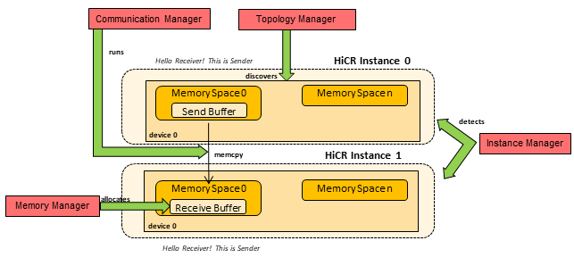

.. _memcpy distributed:

Distributed Memcpy
=======================

In this example, we test HiCR's :code:`memcpy` operation to communicate a simple message back and forth (ping / pong) between two HiCR instances as detected by the :code:`HiCR::InstanceManager` (See: :numref:`remoteMemcpyFig`).

.. _remoteMemcpyFig:

   
   Remote Memcpy Example

The code is structured as follows:

* :code:`include/remoteMemcpy.hpp` contains the application's backend-independent semantics
* :code:`source/` contains variants of the main program implemented under different backends

    * :code:`lpf.cpp` corresponds to the :ref:`lpf backend` backend implementation
    * :code:`mpi.cpp` corresponds to the :ref:`mpi backend` backend implementation

This example expects to be launched with exactly two HiCR instances. For example, by using the following commands:

.. code-block:: bash

    mpirun -n 2 examples/memcpy/distributed/mpi
    lpfrun -n 2 -engine ibverbs examples/memcpy/distributed/lpf

Both the :code:`remoteMemcpy` function receives a full set of :code:`HiCR` managers, used to perform the following steps:

Identifying HiCR instances
----------------------------

Since this example is designed to work with only two HiCR instances, we must check whether this condition is met. For this, we get the total number of instances:

.. code-block:: C++

    auto instanceList = instanceManager->getInstances();
    if (instanceList.size() != 2) // Error: wrong number of instances!

Second, we need to decide which instance is going to be the sender and which the receiver. To decide this, we decide that the HiCR *root instance* must the be sender. The other instance will be the receiver.

.. code-block:: C++

    auto senderId = instanceManager->getRootInstanceId();

Memory Slot Allocation
------------------------

To allocate the memory slots to use as send/receive buffer, we must first identify the local topology and find a suitable memory space from whence to allocate them.

.. code-block:: C++

    // Asking backend to check the available devices
    const auto topology = topologyManager->queryTopology();

    // Getting first device found
    auto device = *topology.getDevices().begin();

    // Obtaining memory spaces
    auto memSpaces = device->getMemorySpaceList();

    // Getting the first memory space we found
    auto firstMemSpace = *memSpaces.begin();

Having found a suitable memory space, we allocate our buffers from it:

.. code-block:: C++

  // Allocating send/receive buffer
  auto bufferSlot = memoryManager->allocateLocalMemorySlot(firstMemSpace, BUFFER_SIZE);

Memory Slot Exchange
-------------------------

After creating the local memory slots, we need to exchange them before they engage in remote communication. The receiver instance exchanges its receive buffer to be visible by the sender. On the other hand, the sender instance does not need to exchange its own buffer.

.. code-block:: C++

  // Performing memory slot exchange now
  if (myInstanceId == senderId)   communicationManager->exchangeGlobalMemorySlots(COMM_TAG, {});
  if (myInstanceId == receiverId) communicationManager->exchangeGlobalMemorySlots(COMM_TAG, {{myInstanceId, bufferSlot}});

  // Synchronizing so that all actors have finished registering their global memory slots
  communicationManager->fence(COMM_TAG);

  // Getting remote memory slot from receiver
  auto receiverSlot = communicationManager->getGlobalMemorySlot(COMM_TAG, receiverId);

Copying Data and Syncing
----------------------------

To copy data, the sender runs :code:`memcpy` with the receiver's memory slot as destination. This acts as a one-sided *put* operation. 

.. code-block:: C++

   if (myInstanceId == senderId) communicationManager->memcpy(receiverSlot, DST_OFFSET, bufferSlot, SRC_OFFSET, BUFFER_SIZE);

.. code-block:: C++

    communicationManager->fence(COMM_TAG);

It is also possible to obtain the number of messages received for a given memory slot:

.. code-block:: C++

    communicationManager->queryMemorySlotUpdates(receiverSlot);
    auto recvMsgs = receiverSlot->getSourceLocalMemorySlot()->getMessagesRecv();

The expected result of running this example is:

.. code-block:: bash

    [Receiver] Received Message Count: 1
    [Receiver] Received buffer: Hello, receiver! This is sender.

