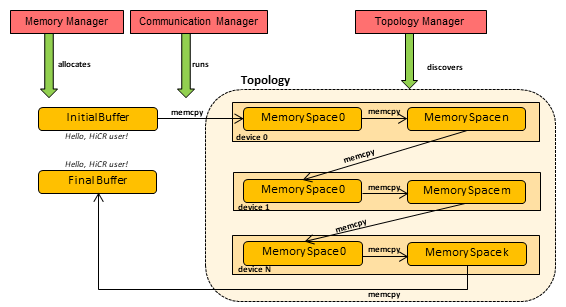

.. _memcpy local:

Local Memcpy
=============

In this example, we test HiCR's :code:`memcpy` operation to run a *Telephone Game* test, where a contiguous memory array is copied along all the memory spaces found in the local HiCR instance, as detected by a :code:`HiCR::TopologyManager`, and then back to the initial space (see :numref:`telephoneGameAPI`). The example then tests the initial and resulting array contain the same bytes. 

.. _telephoneGameAPI:

   
   Telephone Game Example

The code is structured as follows:

* :code:`include/telephoneGame.hpp` contains the application's backend-independent semantics
* :code:`source/` contains variants of the main program implemented under different backends

    * :code:`pthreads.cpp` corresponds to the :ref:`pthreads backend` + :ref:`hwloc backend` backend implementation. This variant moves the initial allocation across all of the system's RAM NUMA domains.
    * :code:`ascend.cpp` corresponds to the :ref:`ascend backend` + :ref:`hwloc backend` backend implementation. This variant moves the initial allocation across all Ascend GPU devices found.
    * :code:`opencl.cpp` corresponds to the :ref:`opencl backend` + :ref:`hwloc backend` backend implementation. This variant moves the initial allocation across all devices found by the OpenCL platform.

Both the producer and consumer functions receive a set of :code:`HiCR::MemorySpace`, each of which will take a turn in the telephone game. They also receive an instance of the :code:`HiCR::MemoryManager`, for the allocation of local memory slots across all memory spaces provided, and; an instance of :code:`HiCR::CommunicationManager`, to communicate the data the HICR memory spaces. 

For each step of the telephone game, the following steps will happen.

Topology detection
------------------

First, we detect the available topology using one topology manager or more than one to detect also heterogeneous devices.

.. code-block:: c++

    // Instantiating hwloc topology manager
    // Pthreads example will only use this
    HiCR::backend::hwloc::TopologyManager ht(&topology);
   
    // Use to detect Ascend devices
    HiCR::backend::ascend::TopologyManager at();

    // Query topologies
    ht.queryTopology();
    at.queryTopology();

Source Local Memory Slot allocation and initialization
------------------------------------------------------

We create the first local memory slot on the host RAM and initialize it with a message.

.. code-block:: c++

    // Instantiating hwloc memory manager
    // Pthreads example will only use this
    HiCR::backend::hwloc::MemoryManager m(&topology);

    auto input         = m.allocateLocalMemorySlot(firstMemSpace, BUFFER_SIZE); // First NUMA Domain

    // Initializing values in memory slot 1
    sprintf((char *)input->getPointer(), "Hello, HiCR user!\n");

Local Memory Slot allocations
-----------------------------

We allocate *N* local memory slot on each memory space detected by the Topology Managers.

.. code-block:: c++

    // memspaces is a collection of all the available namespaces detected
    auto memspaces = ...

    // Collect the newly created memory slots
    auto memSlots = std::vector<std::shared_ptr<HiCR::LocalMemorySlot>>{};

    // iterate all over the memory spaces and create N memory slots in each one
    for (const auto &memSpace : memSpaces)
        for (int i = 0; i < N; i++) memSlots.emplace_back(m.allocateLocalMemorySlot(memSpace, BUFFER_SIZE));

Local Memory Slot memcpy
------------------------

We now iterate through all the memory slots, copying the message around. The fist is the :code:`input` previously created, and the last memory slot is again on the host RAM.

.. code-block:: c++

    // For each of the detected memory slots...
    for (auto dstMemSlot : memSlots)
    {
      // Initialize the memory slot; smoke test for memset
      m.memset(dstMemSlot, 0, BUFFER_SIZE);

      // Perform the memcpy operations
      c.memcpy(dstMemSlot, DST_OFFSET, srcMemSlot, SRC_OFFSET, BUFFER_SIZE);

      // fence when the memcpy happens between two different memory spaces
      c.fence(0);

      // update source memory slot
      srcMemSlot = dstMemSlot;
    }

    // Getting output memory slot (the last one in the list)
    auto output = *memSlots.rbegin();

    // print the output of the telephone game
    printf("Input: %s\n", (const char *)input->getPointer());
    printf("Output: %s\n", (const char *)output->getPointer());

.. note:: 

    In order for the :code:`memcpy` operation to be succesfull between local memory slots allocated by different backends

The expected result of running this example is:

.. code-block:: bash

    Input: Hello, HiCR user!
    Output: Hello, HiCR user!

