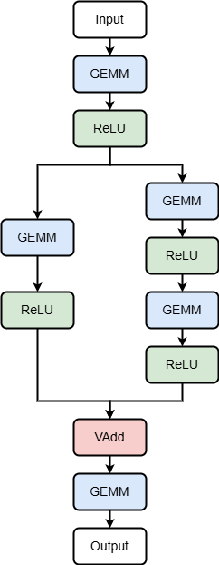

.. _neural network:

Neural Network
=====================

This example runs a neural network in inference against the `MNIST <https://www.kaggle.com/datasets/hojjatk/mnist-dataset>`_ dataset.
The folder contains the following folders:

* :code:`python/` contains the serialized trained model (using `ONNX <https://onnx.ai/>`_), the script to train it, and the script to download the test set
* :code:`proto/` contains cpp protobuf parsers to read ONNX models
* :code:`kernels/` contains :ref:`opencl backend` and :ref:`ascend backend` kernel definitions
* :code:`groundTruth/` contains the network non-HiCR implementation used as a ground truth
* :code:`source/` contains the different variants of this example corresponding to different backends
    * :code:`ascend.cpp` corresponds to the :ref:`ascend backend` backend implementation. The available kernels are compiled for Ascend 910. Run :code:`kernels/compile-ascend.sh` to call `ATC <https://www.hiascend.com/document/detail/zh/CANNCommunityEdition/81RC1alpha001/devaids/devtools/atc/atlasatc_16_0005.html>`__ and compile the kernel.
    * :code:`opencl.cpp` corresponds to the :ref:`opencl backend` backend implementation. The available kernels are compiled for OpenCL.
    * :code:`pthreads.cpp` corresponds to the :ref:`pthreads backend` backend implementation

The program follows the usual initialization analyzed alredy in the :ref:`kernel execution` example.
After that, all the data regarding the neural network are loaded, such as the weights and the test set.
Then, the neural network is created and it's feeded with an image of the dataset at time.

Neural network configuration
-----------------------------

The neural network is created and the corresponding weights are loaded. The input image is loaded as well.

.. code-block:: c++

    // Create the neural network
    auto neuralNetwork = NeuralNetwork(...);
    
    // ONNX trained model
    auto model = ...;
    
    // Load data of the pre-trained model
    neuralNetwork.loadPreTrainedData(model, hostMemorySpace);

    // Create local memory slot holding the tensor image
    auto imageTensor   = loadImage(imageFilePath, ...);

Inference
------------------------------

The network performs the inference following the architecture depicted in :ref:`neural network architecture`, the prediction is extracted and compared with the one provided by the data set

.. _neural network architecture:

   
   Neural Network Architecture

.. code-block:: c++

    // Returns a memory slot with the predictions
    const auto output = neuralNetwork.forward(imageTensor);

    // Get the expected prediction
    auto desiredPrediction = labels[i];

    // Get the actual prediction
    auto actualPrediction  = neuralNetwork.getPrediction(output);

    // Register failures
    if (desiredPrediction != actualPrediction) { failures++; }

The expected result depends on how many images are feeded to the network:

.. code-block:: bash

    # Output with 300 images (configured as test in meson)
    Analyzed images: 100/10000
    Analyzed images: 200/10000
    Total failures: 10/300

    # Output with 10K images (entire MNIST test set, used for the HiCR paper)
    Analyzed images: 100/10000
    Analyzed images: 200/10000
    ...
    Analyzed images: 9800/10000
    Analyzed images: 9900/10000
    Total failures: 526/10000
