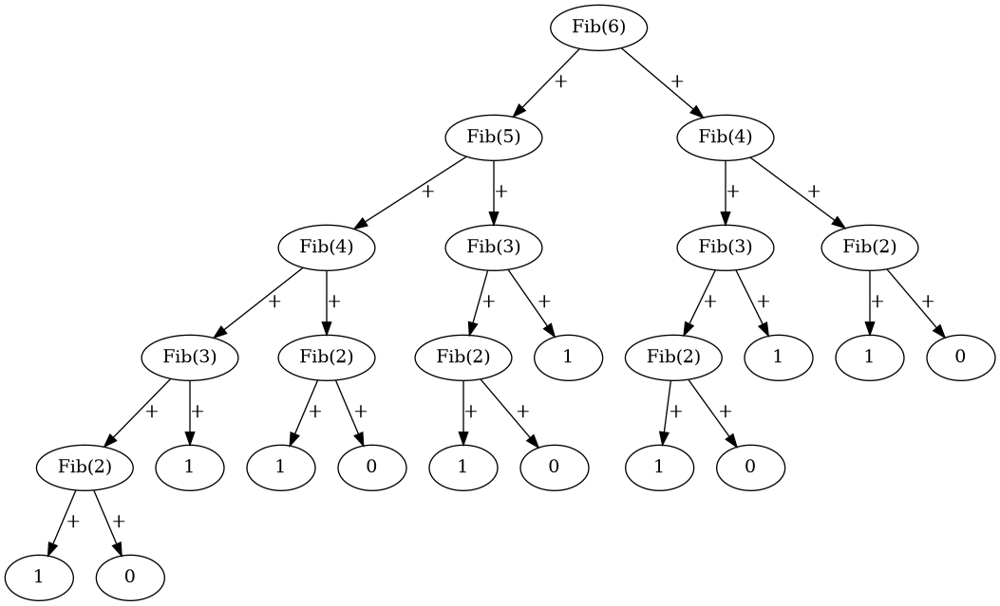

.. _fibonacci:

Tasking: Fibonacci
==================

A simple example of computing the Fibonacci sequence with a task dependency-based runtime system using HiCR.
This example utilizes :ref:`pthreads backend` to create processing units (workers) and :ref:`boost backend` to create execution states (tasks).
This test demonstrates the performance of a runtime system that executes a large number of lightweight tasks and showcases the capability to suspend tasks.

Each call to the Fibonacci(n) function generates two tasks to calculate Fibonacci(n-1) and Fibonacci(n-2). 
Fibonacci(n) will remain suspended until these tasks are completed. 
The recursion terminates when Fibonacci(1)=1 and/or Fibonacci(0)=0 is reached.

Below is a visual representation of Fibonacci(6)=8, which creates a total of 25 tasks.

.. _actorsDiagram:
