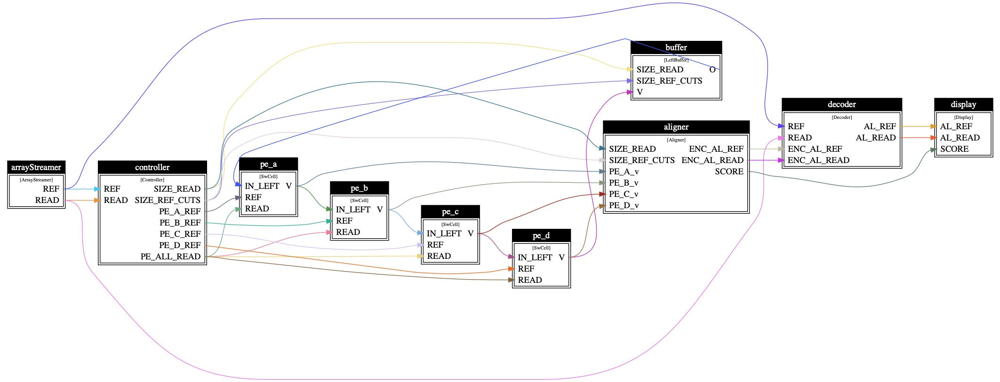

.. _channels:

***********************
Channels
***********************

Apart from the primitive memcpy operations (See :ref:`Memcpy Dist`), channels are a higher-level abstraction for exchanging messages with remote processes.
The use of channels is mostly useful if for a user application:

* the communication pattern is structured as a data flow, or stream
* the communication pattern is repetitive

An excellent use case for a channel would be e.g. a data flow application, which consists of producers continously producing data for consumers.
For example, in the below figure we show an 8-actors data flow application implementing a biology algorith, which can be conveniently implemented via HiCR channels.

.. _actorsDiagram:

A bad use case for a channel would be an application with highly random and very dense communication between communication peers.
For example, an application with many participating processes, where communication follows a random and sparse communication pattern, should rather rely on directly using remote memcpy operations, rather than the channel implementation.

The current channels design in HiCR is as follows:
* A channel is a distributed object, consisting in its basic form of a consumer and a producer of data, usually located on different localities.
* The basic channels are SPSC channels. These are uni-directional (data flows only from producer to consumer)
* The more advanced channels are MPSC/SPMC/MPMC. These are also unidirectional, that is data only flows from producers to consumers
